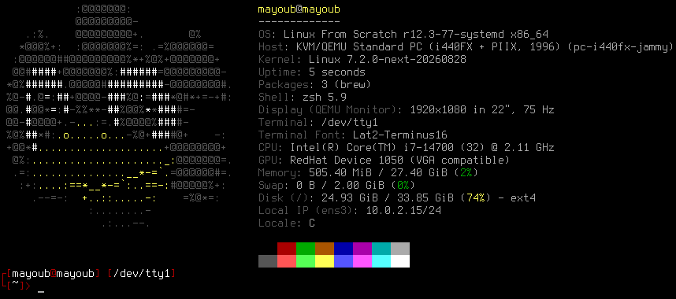

# little-penguin-1

## `little-penguin-1` is a 42's project that introduces students to the world of Linux Kernel Development. Welcome to the world of the Linux kernel architecture, kernel module and kernel compilation.

# The project

The project is divided into *9 assignments*, each assignment covers a specific topic related to Linux kernel development, beginning by compiling the kernel and writing a simple kernel module, then moving on to more complex topics such as writing a character device driver, understanding the kernel's build system, and more.

# Walkthrough

You can find details about the various assignments in the [wiki](https://github.com/Nimpoo/little-penguin-1/wiki) section, along with their detailed, fully-commented solutions. For each assignment, the process leading to the solution is demonstrated, and every step I took is documented until the desired result is achieved. All the assignments are fully sources, every documentation I used for completing the assignments is also provided in the wiki section. 
<small>Be armed with patience…</small>

# Personnal feelings

In a world where 90% of the PCs run on Linux, I think it is important to understand how the kernel works, I found it really interesting to learn about the kernel's architecture, and I enjoyed some parts this project. It was a great opportunity to learn about the Linux kernel, it can maybe a bit overwhelming at first, but with patience and determination, it is possible to understand the kernel's inner workings. 
Maybe these are the first steps toward hardware development.

# Special thanks to:

<table>
  <tr>
    <td align="center"><a href="https://github.com/jbettini/"> <b>jbettini</b></a> </td>
    <td align="center"><a href="https://github.com/noalexan/"> <b>Noah (noalexan)</b></a> </td>
  </tr>
</table>
